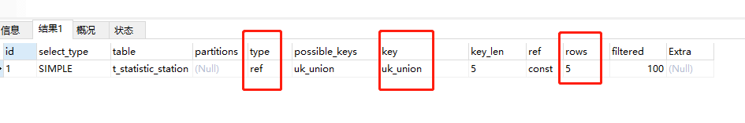

# mysql优化

## 慢sql优化方案

1. 通过 EXPLAIN 命令对语句进行分析，查看命中索引情况（type：访问类型，key：命中索引）和扫描行数（rows：估算的扫描行数）情况。

type的常见值：ALL、index（扫描索引树）、range（按范围检索）、 ref（连表）、eq_ref（通过唯一索引连表）、const（直接命中，如主键索引的等值条件）、system（查询的表只有一行）、NULL（从左到右，性能从最差到最好）。

2. 若 1 中结果与预期不符，考虑索引是否失效。
   - 不符合最左匹配原则：对于组合索引，不是使用组合索引最左边的字段，则不会使用索引
   - 以 % 开头的 like 查询：如`%abc`，无法使用索引；非 % 开头的 like 查询如`abc%`，相当于范围查询，会使用索引
   - 隐式类型转换：查询条件中列类型是字符串，没有使用引号，可能会因为类型不同发生隐式转换，使索引失效
   - 非判断：在索引字段上使用not，<>，!=。不等于操作符是永远不会用到索引的，因此对它的处理只会产生全 表扫描。 优化方法： key<>0 改为 key>0 or key<0。
   - 对索引列进行运算
   - or语句前后没有同时使用索引。当or左右查询字段只有一个是索引，该索引失效，只有当or左右查 询字段均为索引时，才会生效
   - 对索引字段进行计算操作、字段上使用函数。
   - 当全表扫描速度比索引速度快时，mysql会使用全表扫描，此时索引失效。

3. 依照索引生效原则，考虑添加合适的索引。

4. 如果通过索引的方式已经不能够继续提升效率，考虑通过业务上进行限制来进行，比如，在工单综合查询场景中限定每次查询的区间，只能不超过三个月。

## mysql响应变慢的排查思路

