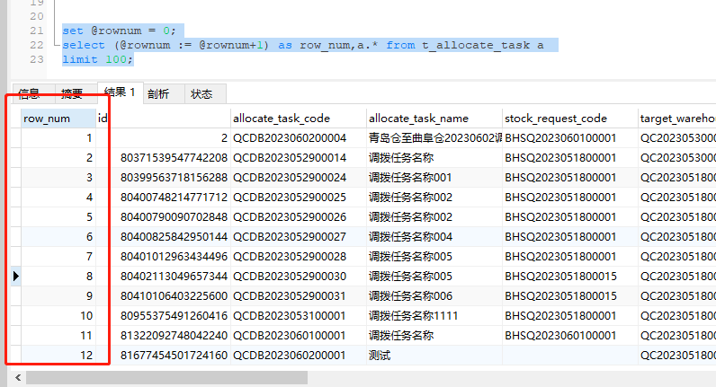

# SQL中变量的定义与使用
## 1.变量的定义与使用步骤
1. 定义变量：使用SET语句来定义一个变量并赋值。例如，SET @variable_name = value;。在这里，@variable_name是您给变量起的名称，value是您要赋给变量的值。

2. 使用变量：一旦定义了变量，您可以在SQL语句中使用它们。在SQL语句中引用变量时，使用@前缀，例如SELECT @variable_name;。

3. 更新变量：您可以使用SET语句更新变量的值。例如，SET @variable_name = new_value;。

4. 查询结果赋给变量：您可以将查询结果存储到变量中。使用SELECT语句将结果分配给变量。例如，SELECT column_name INTO @variable_name FROM table_name WHERE condition;。这将从表中选择满足条件的列，并将结果赋给变量。

使用示例：
```sql
-- 定义变量并赋值
SET @name = 'John';
SET @age = 30;

-- 使用变量
SELECT CONCAT('Name: ', @name, ', Age: ', @age) AS person_info;

-- 更新变量的值
SET @age = 35;

-- 使用更新后的变量
SELECT CONCAT('Name: ', @name, ', Age: ', @age) AS person_info;

-- 将查询结果赋给变量
SELECT COUNT(*) INTO @total_rows FROM customers;

-- 使用包含查询结果的变量
SELECT CONCAT('Total Rows: ', @total_rows) AS result;
```
在上面的示例中，我们定义了两个变量@name和@age，并对其赋值。然后，我们在SELECT语句中使用这些变量来构建结果。之后，我们更新了@age变量的值，并再次使用它来构建结果。最后，我们将查询结果存储在@total_rows变量中，并使用该变量构建结果。

请注意，MySQL中的变量在会话结束后会失效，除非您明确地保存它们的值或将它们存储在表中。

## 2.变量的定义与赋值
变量可以直接指定固定的值，也可以通过查询语句获取值。
```sql
-- 直接指定固定的值
SET @name = 'John';
SET @age = 30;
-- 通过查询语句设置变量的值
SELECT COUNT(*) INTO @total_rows FROM customers;
SET @total_rows = (SELECT COUNT(*) FROM customers);

```

## 3.变量的使用
定义完的变量可以直接在SQL中使用，如上面的SQL中的 `@allocate` 和 `@stock` 。
```sql
-- 1.直接赋值使用变量
SELECT CONCAT('Name: ', @name, ', Age: ', @age) AS person_info;

-- 2.使用包含查询结果的变量
SELECT CONCAT('Total Rows: ', @total_rows) AS result;
```

## SQL变量实战
### 1.通过变量串联多个SQL语句
在项目上线后，由于部分功能未提供，需要通过SQL来暂时满足对应的需求，由于逻辑涉及到多个表的处理，就需要变量来串联多张表处理逻辑，示例如下：

```sql
#终止调拨任务
BEGIN;
#1.设置要终止的调拨任务编号
SET @allocate='XXXX2023070300001';
#2.获取调拨任务关联的备货申请编号
SET @stock = (SELECT stock_request_code FROM t_allocate_task where allocate_task_code = @allocate);
#3.删除占用资产
delete  from t_asset_occupy  where associated_task_code = @allocate;
#4.修改调拨任务状态
update t_allocate_task set task_state = 'terminated' where allocate_task_code = @allocate;
#5.插入调拨任务操作记录
INSERT INTO t_allocate_task_log (id, allocate_task_code, operate_type, operate_content, create_user_id, create_user_name)
SELECT MAX(id) + 1, @allocate, '终止', '由系统管理员终止', -1, '超级管理员' FROM t_allocate_task_log;

#6.修改拆分数量 
update t_stock_request_detail set split_number = 0 where stock_request_code = @stock;

commit;
```
上述SQL的解释如下：
1. 定义了一个变量 `@allocate`，用于存储要终止的调拨任务编号
2. 定义了一个变量 `@stock` ，通过 `@allocate` 获取调拨任务关联的备货申请编号
3. 通过调拨任务号删除占用资产
4. 根据调拨任务号修改调拨任务状态
5. 通过调拨任务号插入调拨任务操作记录
6. 通过备货申请编号修改其已拆分数量。

通过定义 `@allocate` 和 `@stock`，可以在后续的SQL中直接使用，使该段SQL可以方便的进行复用，只需要修改 `@allocate` 的值即可。

### 2.使用变量模拟行号实现id列的插入

在项目上线时，经常有部分表的数据需要进行初始化，由于项目内当前的id值均要求是Long类型的雪花id，如果是通过系统写入数据库数据，可以通过代码中的雪花id生成器来生成，但是如果是通过SQL来写入数据，就需要通过变量来模拟行号来实现id列的插入，示例如下：

```sql
SELECT @rownum := 0; -- 初始化变量

SELECT (@rownum := @rownum + 1) AS row_number, column1, column2, ...
FROM your_table;

```
在上述示例中，我们首先通过 SELECT @rownum := 0 初始化了变量 @rownum。然后，在查询中，我们使用 (@rownum := @rownum + 1) 来递增变量的值，并将其作为行号（row_number）返回。您可以根据需要选择需要返回的其他列。

请注意，在执行上述查询之前，确保使用 SELECT @rownum := 0 初始化了变量 @rownum。然后，您可以在查询中使用 (@rownum := @rownum + 1) 来获得递增的行号。

> PS:需要注意的是，在MySQL中，为了确保变量的赋值和递增操作能够正确执行，需要使用冒号（:）而不是等号（=）。所以，在使用变量进行递增并生成行号的查询中，冒号是必需的。

```sql
set @rownum = 0;
select (@rownum := @rownum+1) as row_num,a.* from t_allocate_task a limit 100;
```


为了能够保证每次使用 `@rownum` 变量时都能够正确的初始化，我们使用冒号（:）来为变量 @rownum 进行赋值和递增操作，并生成行号。通过将 SELECT @rownum := 0 放在子查询中，并通过别名 r 引用，可以确保变量的初始值为0。
如下所示：
```sql
select (@rownum := @rownum+1) as row_num,a.* 
from (SELECT @rownum := 0) r, t_allocate_task a
limit 100;
```
