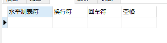
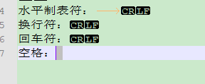
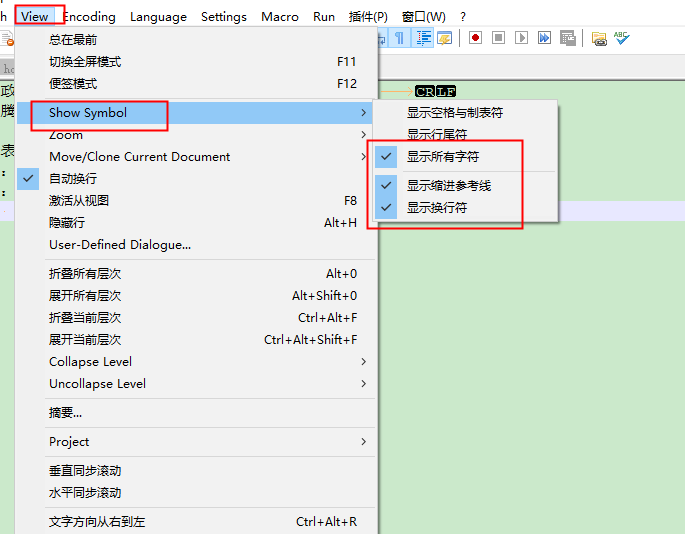

# 去除字段中的换行符与制表符

> 在mysql数据库中，经常会遇到这样情况：
>
> 某表现有数据，经常会存在：回车符、换行符、制表符或空格，如何把这些多余的符号从数据当中剔除出去？

## 处理思路

通过char()和replace()函数来完成；

char(十进制数字)：可以得到对应的ASCII字符；

replace()：可以完成字符替换。

## 字段中可能存在的空白字符

CHAR(9)，对应的是：水平制表符；

CHAR(10)，对应的是：换行符；

CHAR(13)，对应的是：回车符；

CHAR(32)，对应的是：空格。

通过数据库获取到对应的字符。

```sql
select CHAR(9) '水平制表符', CHAR(10) '换行符' , CHAR(13) '回车符',CHAR(32) '空格';
```

执行结果如下：



由于直接看无法看到，可以将其复制到notepad++中查看，如下图：




如果notepad++无法展示对应的字符，可以通过view->Show Symbol，调整字符的显示，如下图：



## 处理数据库数据

### 一、查询包含字符的记录

通过SQL查询指定字段包含对应字符的记录。

```sql
# 查询指定字段包含字符的记录
SELECT
  * 
FROM
  t_wr_customer_line 
WHERE
  LOCATE( CHAR ( 9 ), NAME ) 
  OR LOCATE( CHAR ( 10 ), NAME ) 
  OR LOCATE( CHAR ( 13 ), NAME ) 
  OR LOCATE( CHAR ( 32 ), NAME );
```

### 二、更新指定数据

根据实际情况，写更新语句，由于我不希望把 `NAME` 字段中的去除空格，所以REPLACE中没有 `CHAR ( 32 )` ，可以根据需求编写相应的更新语句。

```sql
update t_wr_customer_line set 
NAME = REPLACE(REPLACE(REPLACE(NAME,CHAR(13),''),CHAR(10),''),CHAR(9),'')
where coustomer_no IN  ('10717','6802');
```

PS：建议通过查询出的记录的唯一字段进行相关的更新动作，防止update语句的范围超出控制。