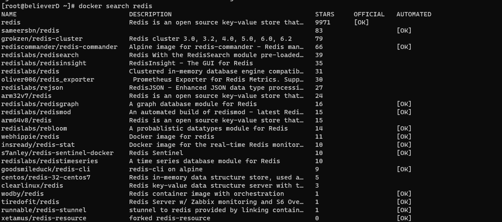
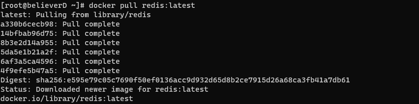
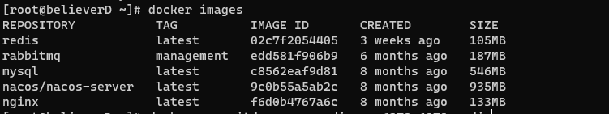
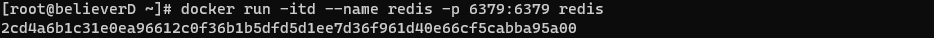
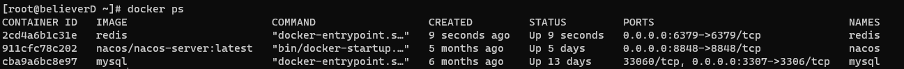
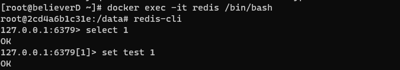

# docker安装redis

## 1.查看redis可用版本

```shell
docker search redis
```



## 2.拉取最新的redis镜像

拉取官方的最新镜像

```shell
docker pull redis:latest
```



## 3.查看本地镜像

```shell
docker images
```



可以看到已经将镜像拉取到

## 4.运行容器

```shell
docker run -itd --name redis-test -p 6379:6379 redis
```



## 5.安装成功

查看容器的运行信息



## 6.测试连接

通过redis-cli连接测试redis服务

```shell
docker exec -it redis-test /bin/bash
```



能够正常的进行redis的操作。

