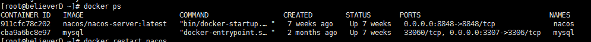

# docker 常用指令


## 安装Docker CE

1. 安装Docker的依赖库。

```
yum install -y yum-utils device-mapper-persistent-data lvm2
```

2. 添加Docker CE的软件源信息。

```
yum-config-manager --add-repo http://mirrors.aliyun.com/docker-ce/linux/centos/docker-ce.repo
```

3. 安装Docker CE。

```
yum makecache fast
yum -y install docker-ce
```

4. 启动Docker服务。

```
systemctl start docker
```

## Docker 镜像拉取

1. 查询镜像

```
docker search rabbitmq
```

2. 下载镜像

```
docker pull rabbitmq
```

3. 本地镜像查看

```
docker images
```

## Docker 镜像删除

1. 删除镜像

```
docker image rm rabbitmq
```


## Docker 容器内存占用查看

```
docker stats
```

## Docker 容器删除

```
docker rm nacos
```

## Docker 查看日志

命令格式：

```shell
$ docker logs [OPTIONS] CONTAINER
  Options:
        --details        显示更多的信息
    -f, --follow         跟踪实时日志
        --since string   显示自某个timestamp之后的日志，或相对时间，如42m（即42分钟）
        --tail string    从日志末尾显示多少行日志， 默认是all
    -t, --timestamps     显示时间戳
        --until string   显示自某个timestamp之前的日志，或相对时间，如42m（即42分钟）
```

例子：

查看指定时间后的日志，只显示最后100行：

```shell
$ docker logs -f -t --since="2018-02-08" --tail=100 CONTAINER_ID
```

查看最近30分钟的日志:

```shell
$ docker logs --since 30m CONTAINER_ID
```

查看某时间之后的日志：

```shell
$ docker logs -t --since="2018-02-08T13:23:37" CONTAINER_ID
```

查看某时间段日志：

```shell
$ docker logs -t --since="2018-02-08T13:23:37" --until "2018-02-09T12:23:37" CONTAINER_ID
```

## 进入容器

### 语法：

docker exec [OPTIONS] CONTAINER COMMAND [ARG...]

#### OPTIONS 参数说明：

- -i: 让容器的标准输入（STDIN）始终保持打开，即使没有输入任何指令（没有附加）
- -t: 分配一个终端，这样我们就可以使用命令来操作
- -d: 分离模式，让命令在后台（指的是宿主后台）运行。
- --user：指定用户运行，当我们需要 root 用户权限时可以指定。

**【注】一般使用 -it 就足够了。**

#### COMMAND 参数：

command 指的是 shell 的类型，常见的有bash、sh、zsh，但是 Linux 系统大多数默认的是 bash 类型，新版 Mac OS 系统的话，默认的不再是 bash ，而是 zsh。

#### 查看正在运行的容器

1.docker ps

执行结果如下：



2.使用 exec 进入容器

```
docker exec -it mysql bash
docker exec -it cba9 bash
```


就可以进入到容器内部的命令行界面。

【注】mysql与 cba9都是容器的唯一标识，所以用哪个都可以。

一般容器里面的 Linux是精简版的，没有 less 、cat 、vim/vi 等命令，如果需要的话可以自己安装，默认自带 APT 命令。


### 退出容器

直接使用命令 exit

