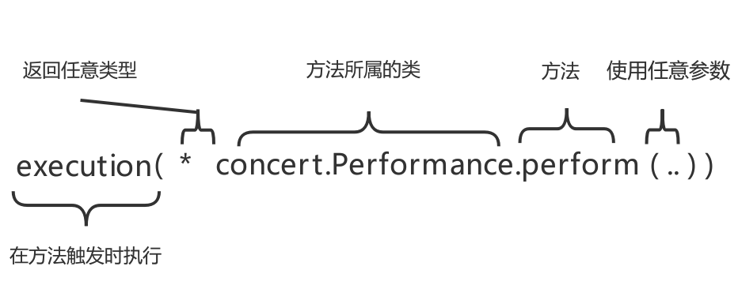
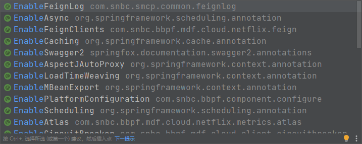

# Feign 日志切面实践

> 背景：统一记录 `Feign` 的调用日志的入参、出参、调用耗时，不因日志做侵入式开发。

## 思路

创建统一的日志切面，以 `@FeignClinet` 注解标识的 `feign` 调用类作为切点，执行对应的入参、出参、调用耗时的记录。

## 分享核心点

1. `feign` 加载的过程中，都做了哪些事，涉及了哪些原理？
1. AOP基础和切点表达式的定义
2. 如何给所有的 `feign` 调用加日志？为什么做不到以 `@FeignClinet` 生成的所有代理类作为切点？
3. 如何将切点表达式提取至配置文件？
4. `@Value` 设置默认值后，为什么读取不到配置文件中的值了？
5. 如何自己仿照开源组件的方案封装成一个功能？

## 基础知识

### Feign 的作用

Spring Cloud 微服务间调用，通常是通过注册中心直接进行调用，常用的方案是 Feign 远程调用，Feign 通过封装，将 HTTP 的构建、调用细节隐藏起来，将服务间调用简化成了类服务内部的接口调用的形式。

### AOP 中涉及的基础概念

#### 连接点

**能够进行通知的任意位置均被称作连接点**。

例如每个方法的前，后（两者都有也行），或抛出异常时都可以是连接点，spring只支持方法连接点。其他如aspectJ还可以让你在构造器或属性注入时都行。

#### 切点

**切点是指通知（Advice）所要织入（Weaving）的具体位置。通过切点表达式限定通知的位置。**

例如一个类里，有15个方法，那就有几十个连接点了，但是你并不想在所有方法附近都使用通知，你只想让其中的几个，在调用这几个方法之前，之后或者抛出异常时干点什么，那么就用切点来定义这几个方法，让切点来筛选连接点，选中那几个想要的方法。

#### 通知

**期望在切点处执行的逻辑，在 AOP 中被称作通知。**

#### 切面

**切面是切点和通知的集合，共同定义了在何处执行何种操作。**

Spring 切面可用的  5 种通知类型：

1. Before——在方法调用之前调用通知
2. After——在方法完成之后调用通知，无论方法执行成功与否
3. After-returning——在方法执行成功之后调用通知
4. After-throwing——在方法抛出异常后进行通知
5. Around——通知包裹了被通知的方法，在被通知的方法调用之前和调用之后执行自定义的行为

#### 织入

**织入是将切面应用到目标对象来创建的代理对象过程。**

切面在指定的连接点被织入到目标对象中，在目标对象的生命周期中有多个点可以织入。


### 切点表达式类型

由下列方式来定义或者通过 &&、 ||、 ! 的方式进行组合：



1. execution：用于匹配方法执行的连接点；
1. within：用于匹配指定类型内的方法执行；
1. this：用于匹配当前 AOP 代理对象类型的执行方法；注意是 AOP 代理对象的类型匹配，这样就可能包括引入接口也类型匹配；
4. target：用于匹配当前目标对象类型的执行方法；注意是目标对象的类型匹配，这样就不包括引入接口也类型匹配；
5. args：用于匹配当前执行的方法传入的参数为指定类型的执行方法；
6. @within：用于匹配所以持有指定注解类型内的方法；
7. @target：用于匹配当前目标对象类型的执行方法，其中目标对象持有指定的注解；
8. @args：用于匹配当前执行的方法传入的参数持有指定注解的执行；
9. @annotation：用于匹配当前执行方法持有指定注解的方法；

eg:

- 任意公共方法的执行：execution(public * *(…))
- 任何一个以“set”开始的方法的执行：execution(* set*(…))
- AccountService 接口的任意方法的执行：execution(* com.xyz.service.AccountService.*(…))
- 定义在service包里的任意方法的执行： execution(* com.xyz.service.*.*(…))
- **定义在service包和所有子包里的任意类的任意方法的执行：execution(* com.snbc.smcp..feign..*(..))**
  1. 第一个 * 表示匹配任意的方法返回值，
  2.  ..(两个点)表示零个或多个层级，com.snbc.smcp.. 表示 smcp 包及其子包，feign.. 表示 feign 包及其子包。
  3. 第二个 * 标识匹配符合上面的路径的包下的所有类
  4. (..) 表示方法的任意参数个数
- 对接口实现类切：实现了 Intf 接口的所有类,如果 Intf 不是接口,限定 Intf 单个类：this(com.test.spring.aop.pointcutexp.Intf)
- 带有指定注解的所有类的任意方法：
  1. @within(org.springframework.transaction.annotation.Transactional)
  2. @target(org.springframework.transaction.annotation.Transactional)

- 带有@Transactional 标注的任意方法：

  @annotation(org.springframework.transaction.annotation.Transactional)

  **注：@within和@target针对类的注解(在 Spring Boot 2.X（即 Spring AOP 5.X）中可以识别接口上的注解[^3^](#refer-anchor)),@annotation是针对方法的注解。**

- 参数带有 @Transactional 标注的方法：@args(org.springframework.transaction.annotation.Transactional)

- 参数为String类型(运行是决定)的方法： args(String)


## 实现演进历程

1. 声明日志切面：通过 @Aspect 声明切面，通过 @Around 和 @Pointcut 进行环绕通知
2. 切点动态配置：考虑将 @Pointcut 的切点表达式提到配置文件，但因为是常量，无法通过 @Value 形式注入。因此变更实现方案为创建 AspectJExpressionPointcutAdvisor 来声明切点和对应拦截器的方式，将切点提取到配置文件中。
3. 默认切点设置：若未主动设置切点表达式，则设置默认切点。
4. 设置自定义开关：通过定义 @EnableFeignLog 注解，将其作为开关，通过在启动类上添加该注解作为开启统一 feign 日志的条件
4. 提取公共组件：作为基础配置提取至common包

### 切点的获取方案

期望切点为含 `@FeignClient` 注解的所有 `feign` 调用接口的方法。过程中考虑了几类方案进行测试验证

1. 通过 `@within(com.snbc.bbpf.mdf.cloud.netflix.feign.FeignClient)` 或 `@target(com.snbc.bbpf.mdf.cloud.netflix.feign.FeignClient)` 的方式令生成的代理类的所有方法成为切点。（不可行，生成的代理类无对应注解）
2. 通过控制 `feign` 接口的包路径设置切点 

### 声明日志切面

#### @Aspect 方案

通过 `@Aspect` 注解实现日志切面。

核心工作：

1. 通过 `@Aspect` 定义切面类。

2. 通过 `@PointCut` 定义切点。
3. 出入参长度截取，调用时间记录。
4. 异常捕获再抛出，`finally` 保证日志打印。

```java
package com.snbc.smcp.workorder.admin.config;

import com.alibaba.fastjson.JSON;
import com.snbc.bbpf.mdf.cloud.netflix.feign.FeignClient;
import lombok.extern.slf4j.Slf4j;
import org.aspectj.lang.ProceedingJoinPoint;
import org.aspectj.lang.annotation.Around;
import org.aspectj.lang.annotation.Aspect;
import org.aspectj.lang.annotation.Pointcut;
import org.aspectj.lang.reflect.MethodSignature;
import org.springframework.beans.factory.annotation.Value;

/**
 * FeignLogAspect 类是 feign调用日志切面
 * 作用：记录feign调用的入参、时长、出参
 * 相关概念：
 * 通知：执行的目标方法
 * 切点：满足条件的目标方法
 * 连接点：切点的全集
 * 切面：切点和通知的组合
 *
 * @author dongyinggang
 * @date 2022-04-12 16:24
 **/
@Aspect
@Slf4j
public class FeignLogAspect {

    /**
     * 出参、入参的限制长度,输出时仅截取该长度
     */
    private static final int LEN_LIMIT = 300;
    @Value("${feignPath}")
    private String feignPath;

    /**
     * getLimitLengthString 方法是 根据传入的对象获取到限制长度的字符串
     *
     * @param object 传入对象
     * @return 限长字符串
     * @author dongyinggang
     * @date 2022/4/14 8:24
     */
    private static String getLimitLengthString(Object object) {

        String json = JSON.toJSONString(object);
        if (json.length() > LEN_LIMIT) {
            json = JSON.toJSONString(object).substring(0, LEN_LIMIT);
        }
        return json;
    }


    /**
     * 期望：使用feignClient注解的接口
     * 结果：无法做到，原因如下
     * 因为feignClient注解的作用目标均是接口，within或target无法获取到切点进行增强
     * this(interface)可以将接口的实现类设置为切点，但每个项目都会有很多feign接口
     * 因此没有好的办法能够直接切中含feignClient的所有代理类
     */
    @Pointcut("@within(com.snbc.bbpf.mdf.cloud.netflix.feign.FeignClient)")
    public void pointAnnotation() {

    }
    
    /**
     * pointPackage 方法是 设置项目目录下任意层级feign文件下的所有类的任意方法作为切点
     * 
     * @author dongyinggang
     * @date 2022/4/20 8:37
     */
    @Pointcut("execution(* com.snbc.smcp..feign..*(..))")
    public void pointPackage() {

    }

    /**
     * invoke 方法是 在切点做的操作：记录入参、feign调用耗时、出参
     * 通过@Around注解声明切点，项目中的feign包的所有方法均为切点,合称连接点
     * 目标包作为切面：    @Around(value = "execution(* com.snbc.smcp.workorder.admin.feign.*.*(..)) " +
     * "|| execution(* com.snbc.smcp.workorder.admin.*.feign.*.*(..)) ")
     * 目标包作为切面    @Around("@within(com.snbc.smcp.workorder.admin..feign.*)")
     * 存在注解的类作为切面    @Around("@within(com.snbc.smcp.workorder.admin.util.stopwatch.StopWatchTime)")
     * 存在注解的类作为切面    @Around("within(org.springframework.web.bind.annotation.RestController)")
     *
     * @param thisJoinPoint thisJoinPoint
     * @return 原方法执行结果
     * @author dongyinggang
     * @date 2021/4/13 20:06
     */
    @Around("pointPackage()")
    public Object invoke(ProceedingJoinPoint thisJoinPoint) throws Throwable {

        //获取类上的注解,判断是否含有feignClient注解
        Class<?>[] list = thisJoinPoint.getTarget().getClass().getInterfaces();
        FeignClient feignClient = null;
        for (Class<?> aClass : list) {
            feignClient = aClass.getAnnotation(FeignClient.class);
            if (feignClient != null) {
                break;
            }
        }
        //判断是否有feignClient的注解,没有注解直接执行
        if (feignClient == null) {
            return thisJoinPoint.proceed();
        }

        MethodSignature methodSignature = (MethodSignature) thisJoinPoint.getSignature();

        // 1.获取当前的方法名“ methodSignature.getName() ”
        String name = methodSignature.getName();
        Object[] inputParam = thisJoinPoint.getArgs();
        // 2.打印入参
        String inputJson = getLimitLengthString(inputParam);

        long start = System.currentTimeMillis();
        Object outParam = null;
        try {
            // 3.执行切入点的方法体
            outParam = thisJoinPoint.proceed();
        } catch (Exception exception) {
            log.error("feign调用异常");
            throw exception;
        } finally {
            // 4.执行完成后打印执行结果,
            String outJson = getLimitLengthString(outParam);
            log.info(" 方法名:{} 入参：{} 耗时信息: {}ms 返回结果：{}",
                    name, inputJson, System.currentTimeMillis() - start, outJson);
        }
        return outParam;
    }

}

```

#### 问题

一、无法通过注解对所有 `feign` 调用类进行环绕通知

1. 支持按注解声明切点 ( `@within/@target` ) 的均只能定义被注解注释的类。

2. 无法将 `@FeignClient` 注解的相关 `feign` 调用接口作为切点，被注释的 `feignClient` 的实现类是动态生成的，不会带有 `@FeignClient` 注解 。

   - 该问题，在 `2020.07` `spring-cloud-openfeign`的 `2.2.4-realease` 进行了处理，给 `@FeignClient` 加上了 `@Inherited` 注解，使注解能够被实现类继承。详情参见此 `issue` https://github.com/spring-cloud/spring-cloud-openfeign/issues/322

   - 在 `Spring 5.×` 版本中,也不存在该问题，原因是在扫描注解时，会将范围扩大至

二、无法将切点表达式提取至配置文件定义

通过 `@Pointcut` 声明切点时，切点表达式是常量，无法通过配置文件自定义


### 切点动态配置

由于无法通过切点表达式精确的控制切点，因此考虑通过以下方案来保证切点范围尽可能的小：

1. 限定扫描路径
2. 进入通知后，判断当前方法所在类的接口是否存在 `@FeignClient` 注解，来判断是否需要做增强。

因为 `@Aspect` 实现的切面类的切点表达式是常量，不能够通过配置文件自定义扫描目录来缩小切点范围，因此将实现方案变更为 `AspectJExpressionPointcutAdvisor` ，在配置类中设定切点表达式和通知。

#### 一、创建拦截器

创建通知类 `FeignLogInterceptor` ,通过实现 `MethodInterceptor` 并重写 `invoke` 方法的方式，拦截目标的方法，来进行增强，记录出参、入参和调用时间。

```java
/**
 * FeignLogInterceptor 类是 统一feign日志拦截器
 *
 * @author dongyinggang
 * @date 2022-04-18 14:02
 **/
@Slf4j
public class FeignLogInterceptor implements MethodInterceptor {

    /**
     * 出参、入参的限制长度,输出时仅截取该长度
     */
    private static final int LEN_LIMIT = 300;


    /**
     * getLimitLengthString 方法是 根据传入的对象获取到限制长度的字符串
     *
     * @param object 传入对象
     * @return 限长字符串
     * @author dongyinggang
     * @date 2022/4/14 8:24
     */
    private static String getLimitLengthString(Object object) {

        String json = JSON.toJSONString(object);
        if (json.length() > LEN_LIMIT) {
            json = JSON.toJSONString(object).substring(0, LEN_LIMIT);
        }
        return json;
    }

    /**
     * invoke 方法是 重写invoke方法，用于增强切点方法的日志功能
     *
     * @param invocation 切点
     * @return 原方法返回结果
     * @author dongyinggang
     * @date 2022/4/19 16:31
     */
    @Override
    public Object invoke(MethodInvocation invocation) throws Throwable {

        //获取类实现的接口列表,判断是否含有feignClient注解的接口
        Class<?>[] list = invocation.getThis().getClass().getInterfaces();
        FeignClient feignClient = null;
        for (Class<?> aClass : list) {
            feignClient = aClass.getAnnotation(FeignClient.class);
            if (feignClient != null) {
                break;
            }

        }
        //判断是否有feignClient的注解,没有注解直接执行
        if (feignClient == null) {
            log.info("不希望进来的类进来了");
            return invocation.proceed();
        }

        // 1.获取当前的方法名“ methodSignature.getName() ”
        String name = invocation.getMethod().getName();
        Object[] inputParam = invocation.getArguments();
        // 2.打印入参
        String inputJson = getLimitLengthString(inputParam);

        long start = System.currentTimeMillis();
        Object outParam = null;
        try {
            // 3.执行切入点的方法体
            outParam = invocation.proceed();
        } catch (Exception exception) {
            log.error("feign调用异常");
            throw exception;
        } finally {
            // 4.执行完成后打印执行结果,
            String outJson = getLimitLengthString(outParam);
            log.info(" 方法名:{} 入参：{} 耗时信息: {}ms 返回结果：{}",
                    name, inputJson, System.currentTimeMillis() - start, outJson);
        }
        return outParam;
    }
}
```

#### 二、创建配置类

创建配置类 `FeignLogConfig` ,在配置类中生成 `AspectJExpressionPointcutAdvisor` 类型的增强对象。

主要步骤包括：

1. 解析并设置切点表达式
2. 设置一中的拦截器，实现切点方法的环绕通知。

对应的配置类如下：

```java
/**
 * FeignLogConfig 类是 feign日志配置类
 *
 * @author dongyinggang
 * @date 2022-04-18 14:19
 **/
public class FeignLogConfig {

    /**
     * 1.优先读取配置文件中配置的连接点表达式
     * 2.若不存在，则会默认设置为当前项目启动类所在目录下的任意层级的feign包下的类
     * <p>
     * #Value 出问题，如果设置如${feignPath:},则配置文件中的配置直接不生效。
     */
    @Value("${feignPath}")
    private String feignPath;

    /**
     * feignLogAdvisor 方法是 配置Advisor（增强）
     * 设置切入点，织入切面
     *
     * @return 返回增强结果
     * @author dongyinggang
     * @date 2022/4/19 15:51
     */
    @Bean
    public AspectJExpressionPointcutAdvisor feignLogAdvisor() {
        //若未指定连接点,则获取当前项目的启动类所在的根目录下任意层级的feign包作为默认值
        if (StringUtils.isEmpty(feignPath)) {
            feignPath = "execution(* com.snbc.smcp..feign..*(..))";
        }
        //构建增强结果
        AspectJExpressionPointcutAdvisor advisor = new AspectJExpressionPointcutAdvisor();
        //切点
        advisor.setExpression(feignPath);
        //拦截器做环绕通知，记录调用的入参、出参、耗时信息,不用注入的方式做是因为common整个没有被扫描,因此不被spring管理
        advisor.setAdvice(new FeignLogInterceptor());
        return advisor;
    }

}
```

切点设置步骤：

1. 通过 `@Value("feignPath")` 读取配置文件中配置的路径，缩小切点范围。
2. 如果未在配置文件中设置 `feignPath` ，则将其设置为默认值 `execution(* com.snbc.smcp..feign..*(..))` 

问题：

**@Value 设置默认值，配置文件中的配置值失效**

样例如下：

1. 代码中设置默认值为空字符串

```java

		@Value("${feignPath:}")
    private String feignPath;
```

2. 配置文件中的配置

```properties
feignPath=execution(* com.snbc.smcp.srds.feign..*(..))
```

3. 加载时会获取到 `@Value `中 `feignPath` 的默认值，而不是期望的配置文件中的配置。

原因未找到，应该是 Spring4 版本的解析问题。`Spring 5.0.3`  实测无该问题。


### 设置自定义开关

在项目启动类上，经常能够看到各式各样的 @Enable 注解，是各种组件用来确认组件启用的开关，例如 @EnableFeignClients （开启 feign 调用）等。



还有一部分组件，通过配置文件中是否配置了对应的配置项来判断是否开启组件功能。

这些都是为了让使用者显式的知道自己启用的内容。

因此，调研了以下两类方案，来实现 feign 日志切面的开关：

1. 自定义 @Enable 注解
2. 通过 @ContionalOn... 注解设置开启条件。详情见[^6^](#refer-anchor)

最终，选择了更主流的自定义 @Enable注解的方案来做。


#### 一、定义开关 @EnableLog 注解

定义开关注解，里面通过 `@Import(FeignLogConfig.class)` 方式将配置类引入。

```java
/**
 * EnableFeignLog 注解是 feign日志开关
 * 使用方式：
 * 1.在启动类上添加 @EnableFeignLog 注解
 * 2.如果想自己声明切点，需要在配置文件中配置 feignPath 属性，例如：feignPath=execution(* com.snbc.smcp..feign..*(..))
 * 3.若未在配置文件声明切点，则默认当前项目启动类所在路径下的任意层级的feign包内的有 @FeignClient 的所有feign调用接口的方法均记录对应日志
 *
 * @author dongyinggang
 * @date 2022/4/19 15:56
 */
@Target(ElementType.TYPE)
@Retention(RetentionPolicy.RUNTIME)
@Documented
@Import(FeignLogConfig.class)
public @interface EnableFeignLog {

}
```

1. 自定义 `@EnableFeignLog` 注解，作为 `feign` 日志的开关
2. 通过 `@Import(FeignLogConfig.class)` 引入了日志配置类。

#### 二、启动类上添加注解

```java
@PlatformApplication()
@EnableFeignClients
@EnableFeignLog
@Import(HandleGlobalException.class)
@EnableAsync
public class AdminApp {
    public static void main(String[] args) {
        //启动BBPF框架
        ConfigurableApplicationContext run = BBPFApplication.run(AdminApp.class, args);
        SpringContextUtil.setApplicationContext(run);
    }
}
```

在启动类上添加 @EnableFeignLog 注解开启 Feign 统一日志。 

### 提取公共组件

因为希望项目中多个微服务均能够使用该方案用来记录 Feign ，因此需要将相关的代码抽取到公共模块中，让别的项目引入后即可显式开启。

将相关的类均移至公共模块下，公共模块版本升级，其他项目引入升级后的版本，即可通过 @EnableFeignLog 来开启feign日志记录。

## 参考文章

<div id = "refer-anchor"></div>

1. [@Pointcut 注解的使用](https://blog.csdn.net/baidu_37366055/article/details/109989145)
2. [Spring-AOP @AspectJ切点函数之@within()和@target](https://cloud.tencent.com/developer/article/1862474)
3. [接口方法上的注解无法被@Aspect声明的切面拦截的原因分析](https://my.oschina.net/guangshan/blog/1808373)
4. [实用：如何将aop中的pointcut值从配置文件中读取](https://blog.csdn.net/itguangit/article/details/103345666)
5. [Spring @Value 设置默认值的实现](https://www.jb51.net/article/195376.htm)
6. [自定义@Configuration配置类启用开关](https://blog.csdn.net/ming19951224/article/details/112759717)
7. [@ConditionalOn...注解，条件组合你知道吗？](https://mp.weixin.qq.com/s/ao3uWOu05lTHltIDdsI87g)
8. [spring aop获取方法上与类上的注解](https://blog.csdn.net/wwq997/article/details/122452423)
9. [【Feign终极解析】](https://mp.weixin.qq.com/s/SlWt9qGqRQNjlidcTcjYGg)
10. [Feign原理 （图解）](https://www.cnblogs.com/crazymakercircle/p/11965726.html)
11. [AOP的核心包： aopalliance ](https://blog.51cto.com/u_3631118/3121441)
12. [记一次feign接口耗时调优过程](https://blog.csdn.net/lj252217616/article/details/119714955)
13. [@Inherited 的使用](https://www.cnblogs.com/skasj/p/14052977.html)
14. [@Aspect的@FeignClient实现类切点替代方案](https://github.com/spring-cloud/spring-cloud-openfeign/issues/59)
15. [Spring cloud openfeign对@FeignClient的升级](https://github.com/spring-cloud/spring-cloud-openfeign/issues/322)

