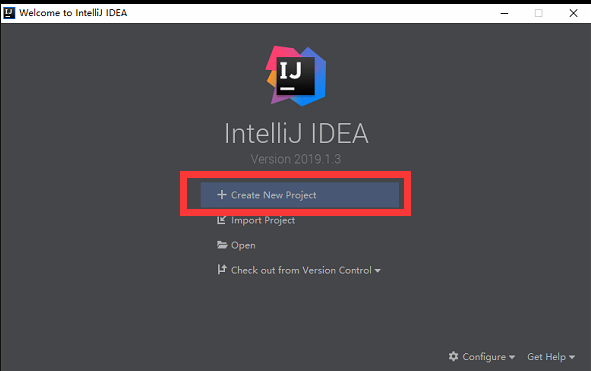
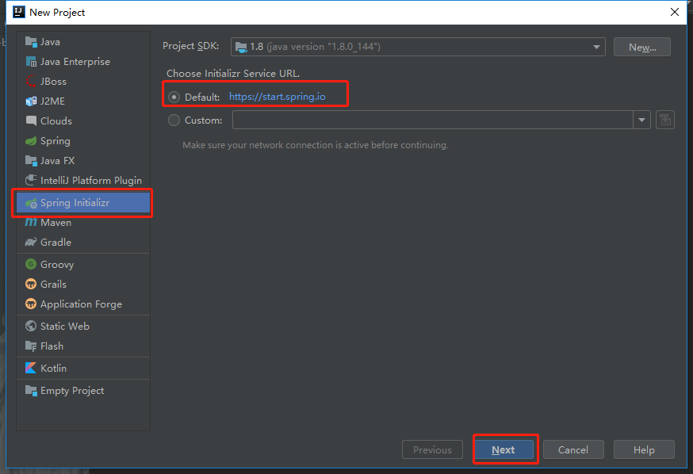
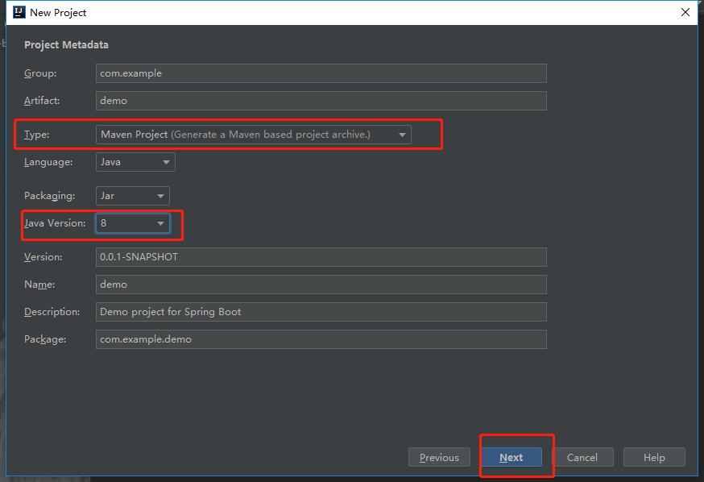
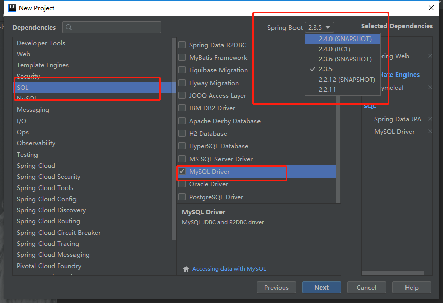
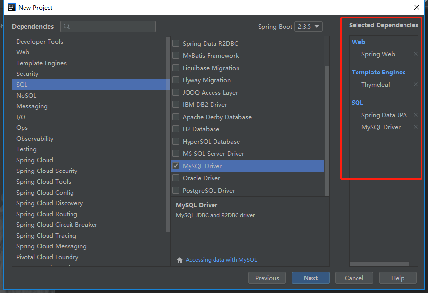
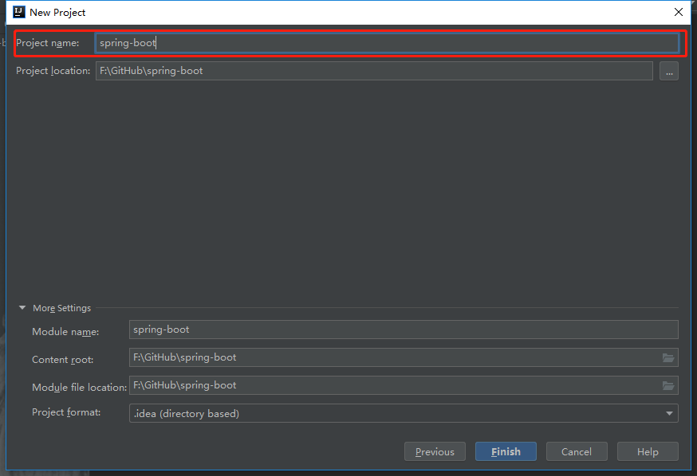
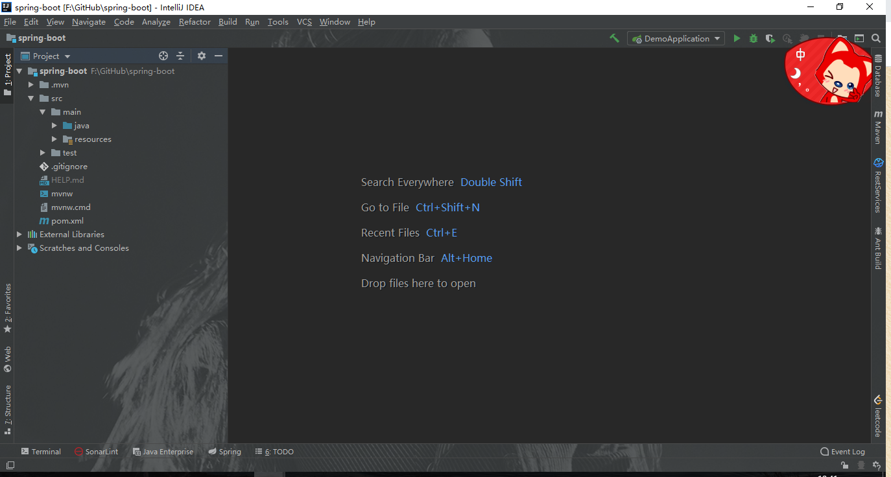
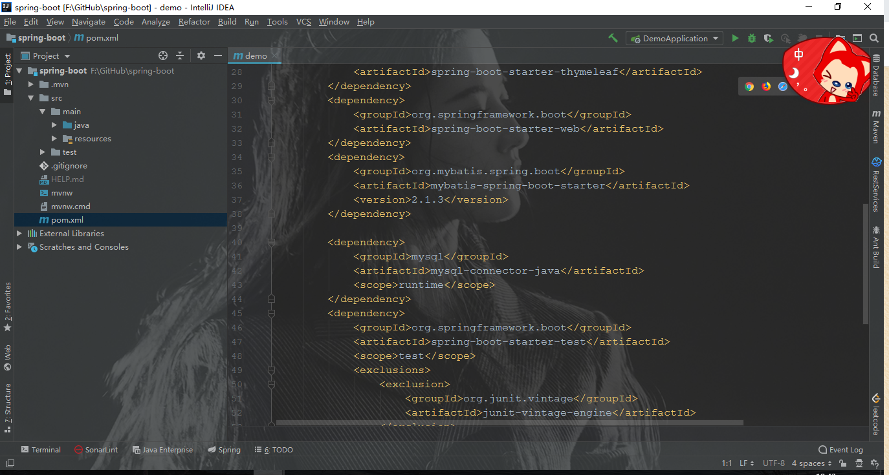

# idea中的springboot项目创建

1.打开IDEA，点击 +Create New Project. 开始创建一个新项目。



2.在左侧菜单找到并点击 Spring Initializr，点击next。注意，这里idea默认使用[https://start.spring.io](https://start.spring.io/)提供的在线模板，所以需要保证网络畅通。



3.按实际情况依次填写项目信息。其中Type属性可以下拉选择project或者pom，Packaging属性可下拉选择jar或者war（Maven的东西不需要再提了吧）。



4.最激动人心的界面来了！！！你可以从左面选择大类，然后在窗口中间勾选需要的依赖。右边可以看到已选择的依赖项。

上边下拉框可以选择Spring Boot的版本，完成后点击 Next。

这里我选择了“Web”类别下的“Spring Web”、“Template”类别下的“Thymeleaf”以及“SQL”类别下的“Spring Data JPA”和“Mysql Driver”。





5. 终于，最后一步了。设置项目名称Project name 和 工程保存路径 Project location。完成后，点击 Finish。



 6.等待IDEA构建好项目后，项目结构如下图所示。根据每个人在第4步选择的依赖不同，目录结构大同小异。



 7.再看看pom.xml，我们需要的依赖都静静的躺在里面。如果需要另外的依赖，只需要再次向pom.xml中进行写入就可以了。



 8.写个简单接口试试新建的工程好不好使。

```java
/**
 * HelloController 类是 Spring boot 项目 测试Controller
 *
 * @author dongyinggang
 * @date 2020-11-11 18:47
 **/
@RestController
@RequestMapping("test")
public class HelloController implements HelloApi {

    /**
     * hello 方法是 测试
     *
     * @return 测试结果
     * @author dongyinggang
     * @date 2020/11/11 18:49
     */
    @RequestMapping("hello")
    @Override
    public String hello() {
        return "调用成功";
    }
}
```

spring boot，启动。

由于依赖了数据库，因此启动时，项目会去尝试连接数据库，此时，若配置文件中无数据库连接信息，会报错，因此，在 application.properties 中加入数据库配置，如下：

```properties
# 数据库连接
spring.datasource.url=jdbc:mysql://127.0.0.1:3306/test?allowMultiQueries=true&serverTimezone=UTC
spring.datasource.driver-class-name=com.mysql.cj.jdbc.Driver
spring.datasource.username=root
spring.datasource.password=
```

9.再次启动，访问看看效果


可以看到，成功调用。

## 参考内容

【1】[使用IDEA创建一个springboot项目](https://www.cnblogs.com/little-rain/p/11063967.html)