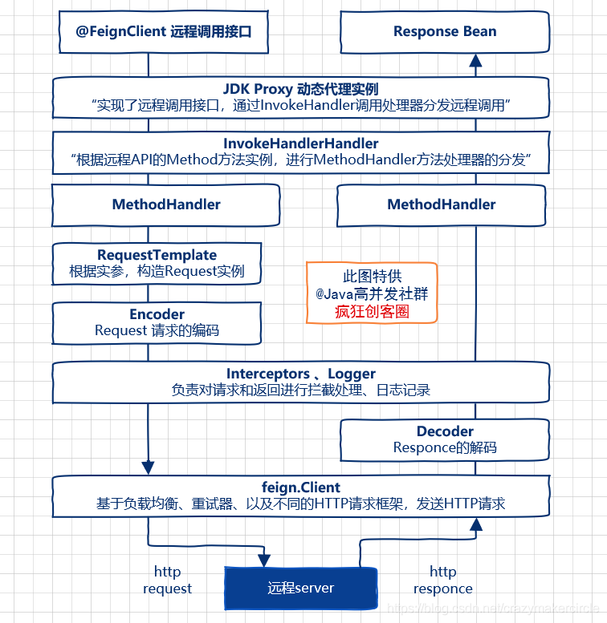

# Feign 2：原理

## 基本流程

Feign远程调用，核心就是通过一系列的封装和处理，将以JAVA注解的方式定义的远程调用API接口，最终转换成HTTP的请求形式，然后将HTTP的请求的响应结果，解码成JAVA Bean，放回给调用者。Feign远程调用的基本流程，大致如下图所示。

## 重要组件

### 远程接口的本地JDK Proxy代理实例

**远程接口的本地JDK Proxy代理实例**，有以下特点：

（1）Proxy代理实例，实现了一个加 @FeignClient 注解的远程调用接口；

（2）Proxy代理实例，能在内部进行HTTP请求的封装，以及发送HTTP 请求；

（3）Proxy代理实例，能处理远程HTTP请求的响应，并且完成结果的解码，然后返回给调用者。

### 调用处理器 InvocationHandler

通过 JDK Proxy 生成动态代理类，核心步骤就是需要定制一个调用处理器，具体来说，就是实现JDK中位于java.lang.reflect 包中的 InvocationHandler 调用处理器接口，并且实现该接口的 invoke（…） 抽象方法。

为了创建Feign的远程接口的代理实现类，Feign提供了自己的一个默认的调用处理器，叫做 FeignInvocationHandler 类，该类处于 feign-core 核心jar包中。当然，调用处理器可以进行替换，如果Feign与Hystrix结合使用，则会替换成 HystrixInvocationHandler 调用处理器类，类处于 feign-hystrix 的jar包中。

## 参考内容

1. [Spring Cloud OpenFeign 工作原理解析](https://blog.csdn.net/lengxiao1993/article/details/103511695)
2. [Spring Cloud 2.2.2 源码之二十Feign初始化一](https://blog.csdn.net/wangwei19871103/article/details/105658275)
3. [【Feign终极解析】](https://mp.weixin.qq.com/s/SlWt9qGqRQNjlidcTcjYGg)
4. [Feign原理 （图解）](https://www.cnblogs.com/crazymakercircle/p/11965726.html)