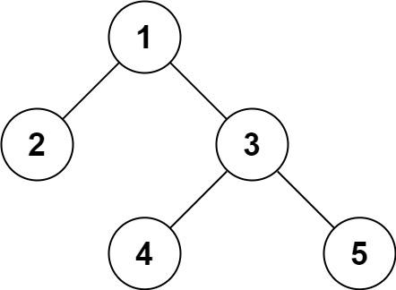

# 

## 题干

```
序列化是将一个数据结构或者对象转换为连续的比特位的操作，进而可以将转换后的数据存储在一个文件或者内存中，同时也可以通过网络传输到另一个计算机环境，采取相反方式重构得到原数据。

请设计一个算法来实现二叉树的序列化与反序列化。这里不限定你的序列 / 反序列化算法执行逻辑，你只需要保证一个二叉树可以被序列化为一个字符串并且将这个字符串反序列化为原始的树结构。

提示: 输入输出格式与 LeetCode 目前使用的方式一致，详情请参阅 LeetCode 序列化二叉树的格式。你并非必须采取这种方式，你也可以采用其他的方法解决这个问题。

示例 1：
输入：root = [1,2,3,null,null,4,5]
输出：[1,2,3,null,null,4,5]
示例 2：

输入：root = []
输出：[]
示例 3：

输入：root = [1]
输出：[1]
示例 4：

输入：root = [1,2]
输出：[1,2]

提示：

树中结点数在范围 [0, 10^4] 内
-1000 <= Node.val <= 1000

来源：力扣（LeetCode）
链接：https://leetcode-cn.com/problems/serialize-and-deserialize-binary-tree
著作权归领扣网络所有。商业转载请联系官方授权，非商业转载请注明出处。
```

示例一如图



## 代码

通过层序遍历(BFS)，逐层遍历二叉树。

序列化时，通过不断访问左右子树，将所有节点都写到

```java
public class Codec {

    // Encodes a tree to a single string.
    public String serialize(TreeNode root) {
        if(null == root){
            return "";
        }
        List<String> list = new ArrayList<>();
        Queue<TreeNode> q = new LinkedList<>();
        q.add(root);
        while(!q.isEmpty()){
            TreeNode cur = q.poll();
            if(cur == null){
                list.add("null");
                continue;
            }
            list.add(cur.val+"");
            q.add(cur.left);
            q.add(cur.right);
        }
        return String.join(",",list);
    }

    // Decodes your encoded data to tree.
    public TreeNode deserialize(String data) {
        if("".equals(data)){
            return null;
        }
        
        String[] arr = data.split(",");
        TreeNode root = new TreeNode(Integer.valueOf(arr[0]));
        int i = 1;
        Queue<TreeNode> q = new LinkedList<>();
        q.add(root);
        while(!q.isEmpty()){
            TreeNode cur = q.poll();
            //子节点若为null,则不会进队,
            if(!"null".equals(arr[i])){
                cur.left = new TreeNode(Integer.valueOf(arr[i]));
                q.add(cur.left);
            }
            i++;
            if(!"null".equals(arr[i])){
                cur.right = new TreeNode(Integer.valueOf(arr[i]));
                q.add(cur.right);
            }
            i++;
        }
        return root;
    }
}
```

## 复杂度分析

- 时间复杂度：序列化和反序列化的时候都是整个遍历了一次二叉树，渐进复杂度为O（n）
- 空间复杂度：考虑递归使用的栈空间的大小，栈空间的使用和递归深度有关，递归深度和二叉树的深度有关，最差情况下，二叉树退化成一条链，所以渐进空间复杂度O（n）


