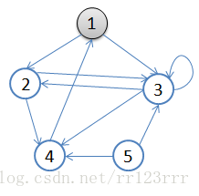
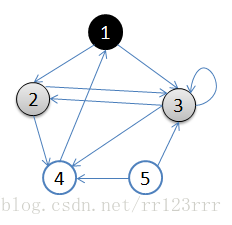
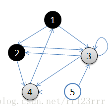
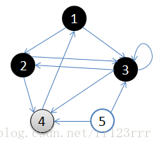
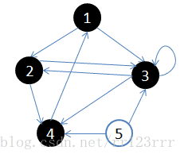

# 算法理论 02：BFS算法

> BFS(广度搜索算法，Breadth First Search) 的核心思想应该不难理解的，就是把一些问题抽象成图，从一个点开始，向四周开始扩散。一般来说，我们写 BFS 算法都是用「队列」这种数据结构，每次将一个节点周围的所有节点加入队列。
>
> BFS 相对 DFS 的最主要的区别是：**BFS 找到的路径一定是最短的，但代价就是空间复杂度比 DFS 大很多**

## 一、算法原理

广度优先搜索（BFS）是按层来处理顶点，距离开始点最近的那些顶点首先被访问，而最远的那些顶点则最后被访问，这个和树的层序变量很像，BFS的代码使用了一个队列。搜索步骤：

1. 首先选择一个顶点作为起始顶点，并将其染成灰色，其余顶点为白色。

2. 将起始顶点放入队列中。

3. 从队列首部选出一个顶点，并找出所有与之邻接的顶点，将找到的邻接顶点放入队列尾部，将已访问过顶点涂成黑色，没访问过的顶点是白色。如果顶点的颜色是灰色，表示已经发现并且放入了队列，如果顶点的颜色是白色，表示还没有发现
4. 按照同样的方法处理队列中的下一个顶点。

基本就是出队的顶点变成黑色，在队列里的是灰色，还没入队的是白色。
  

用一副图来表达这个流程如下：

1.初始状态，从顶点1开始，队列={1}




2.访问1的邻接顶点，1出队变黑，2,3入队，队列={2,3,}



3.访问2的邻接顶点，2出队，4入队，队列={3,4}



4.访问3的邻接顶点，3出队，队列={4}



5.访问4的邻接顶点，4出队，队列={ 空}



```
从顶点1开始进行广度优先搜索：
  初始状态，从顶点1开始，队列={1}
  访问1的邻接顶点，1出队变黑，2,3入队，队列={2,3,}
  访问2的邻接顶点，2出队，4入队，队列={3,4}
  访问3的邻接顶点，3出队，队列={4}
  访问4的邻接顶点，4出队，队列={ 空}
  顶点5对于1来说不可达。
```

## 二、算法框架

要说框架的话，我们先举例一下 BFS 出现的常见场景好吧，**问题的本质就是让你在一幅「图」中找到从起点** **`start`** **到终点** **`target`** **的最近距离**

这个广义的描述可以有各种变体，比如走迷宫，有的格子是围墙不能走，从起点到终点的最短距离是多少？如果这个迷宫带「传送门」可以瞬间传送呢？

再比如说两个单词，要求你通过某些替换，把其中一个变成另一个，每次只能替换一个字符，最少要替换几次？

再比如说连连看游戏，两个方块消除的条件不仅仅是图案相同，还得保证两个方块之间的最短连线不能多于两个拐点。你玩连连看，点击两个坐标，游戏是如何判断它俩的最短连线有几个拐点的？

净整些花里胡哨的，这些问题都没啥奇技淫巧，本质上就是一幅「图」，让你从一个起点，走到终点，问最短路径。这就是 BFS 的本质。

算法框架如下：

```java
// 计算从起点 start 到终点 target 的最近距离
int BFS(Node start, Node target) {
    Queue<Node> q; // 核心数据结构
    Set<Node> visited; // 避免走回头路

    q.offer(start); // 将起点加入队列
    visited.add(start);
    int step = 0; // 记录扩散的步数

    while (q not empty) {
        int sz = q.size();
        /* 将当前队列中的所有节点向四周扩散 */
        for (int i = 0; i < sz; i++) {
            Node cur = q.poll();
            /* 划重点：这里判断是否到达终点 */
            if (cur is target)
                return step;
            /* 将 cur 的相邻节点加入队列 */
            for (Node x : cur.adj())
                if (x not in visited) {
                    q.offer(x);
                    visited.add(x);
                }
        }
        /* 划重点：更新步数在这里 */
        step++;
    }
}
```

