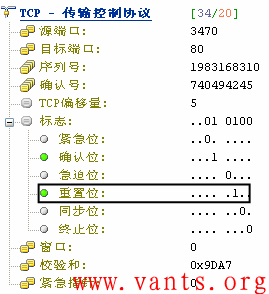
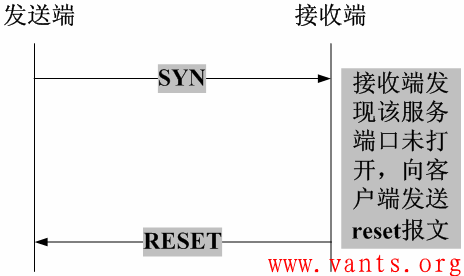
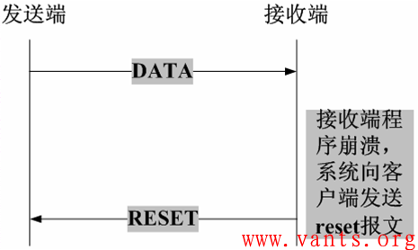
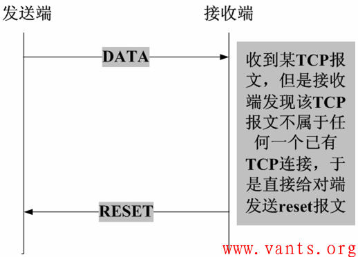
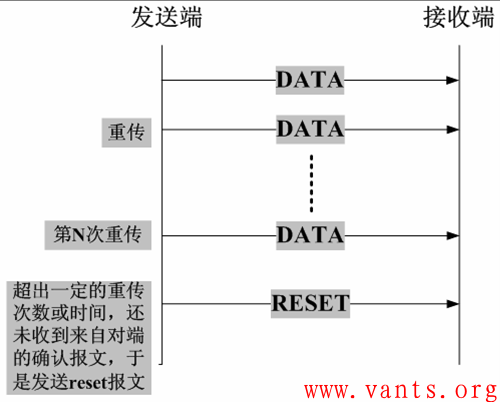
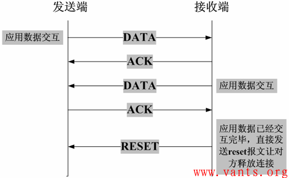

# 网络编程(七)：TCP异常终止

[原文地址](https://blog.csdn.net/ixidof/article/details/8049667)

**TCP的异常终止是相对于正常释放TCP连接的过程而言的**，我们都知道，TCP连接的建立是通过三次握手完成的，而TCP正常释放连接是通过四次挥手来完成，但是有些情况下，TCP在交互的过程中会出现一些意想不到的情况，导致TCP无法按照正常的四次挥手来释放连接，如果此时不**通过其他的方式来释放TCP连接**的话，这个TCP连接将会一直存在，占用系统的部分资源。在这种情况下，我们就需要有一种能够释放TCP连接的机制，这种机制就是TCP的reset报文。reset报文是指TCP报头的标志字段中的reset位置一的报文，如下图所示：

**TCP异常终止的常见情形**

我们在实际的工作环境中，导致某一方发送reset报文的情形主要有以下几种：

1，客户端尝试与服务器**未对外提供服务的端口**建立TCP连接，服务器将会直接向客户端发送reset报文。

2，客户端和服务器的某一方在交互的过程中发生异常（如程序崩溃等），该方系统将向对端发送TCP reset报文，告之对方释放相关的TCP连接，如下图所示：

3，接收端收到TCP报文，但是发现该TCP的报文，并不在其已建立的TCP连接列表内，则其直接向对端发送reset报文，如下图所示：

4，在交互的双方中的某一方长期未收到来自对方的确认报文，则其在超出一定的重传次数或时间后，会主动向对端发送reset报文释放该TCP连接，如下图所示：

5，有些应用开发者在设计应用系统时，会利用reset报文快速释放已经完成数据交互的TCP连接，以提高业务交互的效率，如下图所示：

**Reset报文的利用**

1安全设备利用reset报文阻断异常连接

安全设备（如防火墙、入侵检测系统等）在发现某些可疑的TCP连接时，会构造交互双方的reset报文发给对端，让对端释放该TCP连接。比如入侵检测检测到黑客攻击的TCP连接，其构造成被攻击端给黑客主机发送reset报文，让黑客主机释放攻击连接。

2利用reset报文实施攻击

安全设备可以利用reset报文达到安全防护的效果，黑客和攻击者也可以利用reset报文实现对某些主机的入侵和攻击，最常见的就是TCP会话劫持攻击。关于TCP会话劫持的相关知识请参考第三章《TCP会话劫持》一文。

