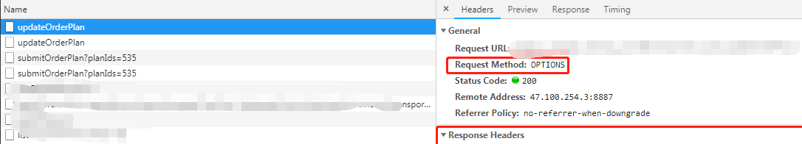
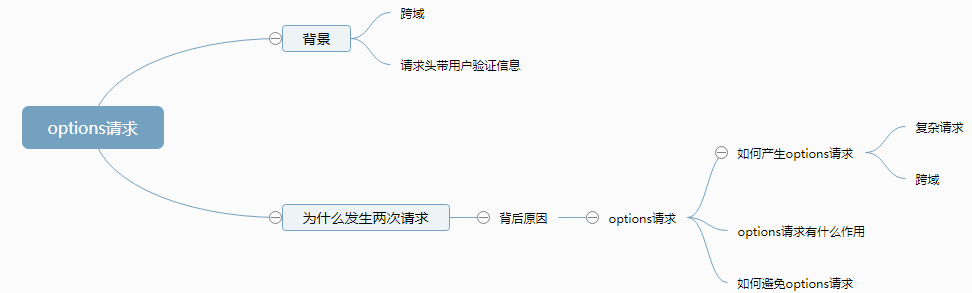
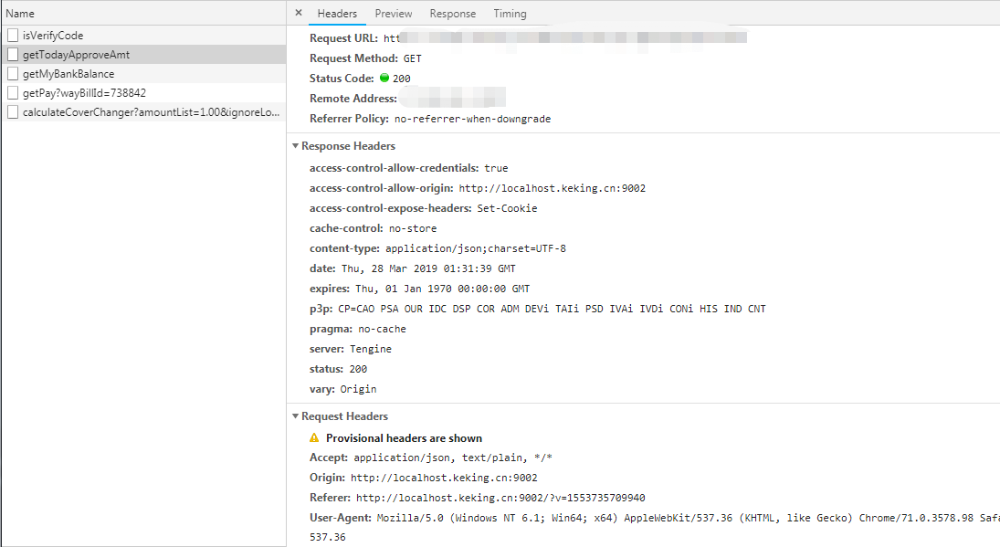
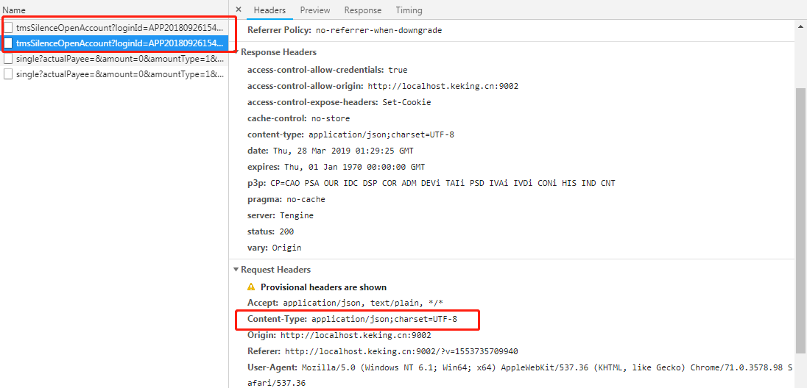
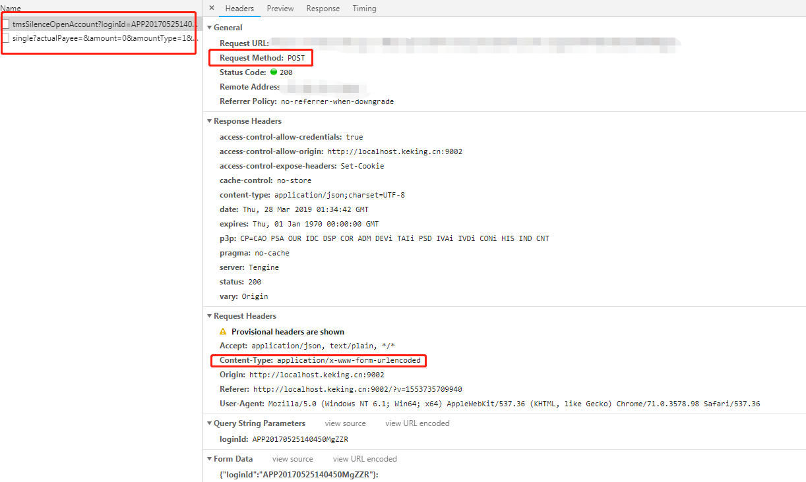

# 网络编程(八)：HTTP的请求类型

## 八种请求类型

HTTP的八种请求类型:OPTION、HEADER、GET、POST、PUT、DELETE、TRANCE、CONNECT

1、OPTION 返回给服务器针对特定资源所支持的请求方式，也可以利用向web服务器发送‘*’的请求来测试服务器的功能性。

2、HEADER是需要向服务器索要与GET一样的请求，但是不返回返回体，这个方法可以在不必传输整个响应内容的情况下，获取包含在响应消息头中的元信息。

3、GET 向指定资源请求数据，一般用来获取，查询资源信息，较不安全，幂等（幂等是对同一URL的多个请求应该返回同样的结果）的，只用来获取数据不会修改数据，其请求显示在url上，会被缓存，对请求长度有限制。和post是常用的提交方式。

4、POST 向指定资源提交数据进行请求处理，一般用来更新资源信息，非幂等，请求显示在请求体里面，不会被缓存，对请求长度无限制。

5、PUT 向指定资源上传最新的内容

6、DELETE 请求服务器器删除Request-URI所标识的资源。

7、TRANCE 回显服务器收到的请求，主要用于测试或诊断。

8、CONNECT HTTP1.1预留给可以将连接改为管道方式的服务器

## 延伸：http请求发生了两次(options请求)

### 前言

自后台restful接口流行开来，请求了两次的情况（options请求）越来越普遍。笔者也在实际的项目中遇到过这种情况，做一下整理总结。

### 文章书写思路：

### 为什么发生两次请求

http的请求方式，包括OPTIONS、GET、HEAD、POST、PUT、DELETE、TRACE和CONNECT等八种请求方式。其中，get与post只是我们常用的请求方式。

我们能在图一里看到，第一条的请求方式为options，第二条请求，才是我们预想中的请求。所以为什么发生两条请求的原因就变成了为什么发生options请求。

### options请求

options请求的官方定义：OPTIONS方法是用于请求获得由Request-URI标识的资源在请求/响应的通信过程中可以使用的功能选项。通过这个方法，客户端可以在采取具体资源请求之前，决定对该资源采取何种必要措施，或者了解服务器的性能。

用白话说就是：在发生正式的请求之前，先进行一次预检请求。看服务端返回一些信息，浏览器拿到之后，看后台是否允许进行访问。

### 如何产生options请求：

产生options请求的原因包括以下几条：

**1：产生了复杂请求**。复杂请求对应的就是简单请求。简单请求的定义是：

1.  请求方法是GET、HEAD或者POST，并且当请求方法是POST时，Content-Type必须是application/x-www-form-urlencoded, multipart/form-data或着text/plain中的一个值。
2.  请求中没有自定义HTTP头部。

所谓的自定义头部，在实际的项目里，我们经常会遇到需要在header头部加上一些token或者其他的用户信息，用来做用户信息的校验。

***注**：浏览器对简单请求的判定规则是：

> （1) 请求方法是以下三种方法之一：
>
> - HEAD
> - GET
> - POST
>
> （2）HTTP的头信息不超出以下几种字段：
>
> - Accept
> - Accept-Language
> - Content-Language
> - Last-Event-ID
> - Content-Type：只限于三个值`application/x-www-form-urlencoded`、`multipart/form-data`、`text/plain`

**2：发生了跨域。**

### **options请求有什么作用**

官方将头部带自定义信息的请求方式称为带预检（preflighted）的跨域请求。在实际调用接口之前，会首先发出一个options请求，检测服务端是否支持真实的请求进行跨域的请求。真实请求在options请求中，通过request-header将 Access-Control-Request-Headers与Access-Control-Request-Method发送给后台，另外浏览器会自行加上一个Origin请求地址。服务端在接收到预检请求后，根据资源权限配置，在response-header头部加入access-control-allow-headers（允许跨域请求的请求头）、access-control-allow-methods（允许跨域请求的请求方式）、access-control-allow-origin（允许跨域请求的域）。另外，服务端还可以通过Access-Control-Max-Age来设置一定时间内无须再进行预检请求，直接用之前的预检请求的协商结果即可。浏览器再根据服务端返回的信息，进行决定是否再进行真实的跨域请求。这个过程对于用户来说，也是透明的。

另外在HTTP响应头，凡是浏览器请求中携带了身份信息，而响应头中没有返回Access-Control-Allow-Credentials: true的，浏览器都会忽略此次响应。

总结：只要是带自定义header的跨域请求，在发送真实请求前都会先发送OPTIONS请求，浏览器根据OPTIONS请求返回的结果来决定是否继续发送真实的请求进行跨域资源访问。所以复杂请求肯定会两次请求服务端。

### **options请求如何避免**

其实通过以上的分析，我们能得出以下解决方案：

1：使用代理，避开跨域。

2：将复杂跨域请求更改为简单跨域请求。

3：不使用带自定义配置的header头部。

###  实际案例

笔者现在维护的项目之一是用angularjs作为框架，使用$resoruce进行的通信，请求头默认采用content-type: application/json。所以即使拿掉请求头里前台自定义的token，仍然还会在post请求中额外发出options请求，因为不满足简单请求的条件。而get请求没有这这个情况。

笔者将header头里的token拿掉后，get的options请求消除了。

上图中，post发出了options请求。原因在于content-type。

**去除post的options请求：**

## 参考内容

【1】[ajax 跨域请求，每次会发送两个请求？](https://my.oschina.net/u/2399303/blog/1631444)

【2】[有关HTTP的PATCH提交方式](https://blog.csdn.net/lcf_lxf_ldy/article/details/84646675)

【3】[http请求发生了两次（options请求）](https://www.cnblogs.com/mamimi/p/10602722.html)