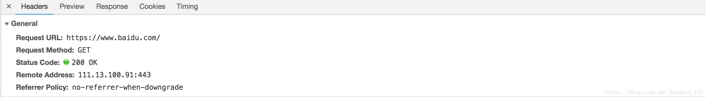
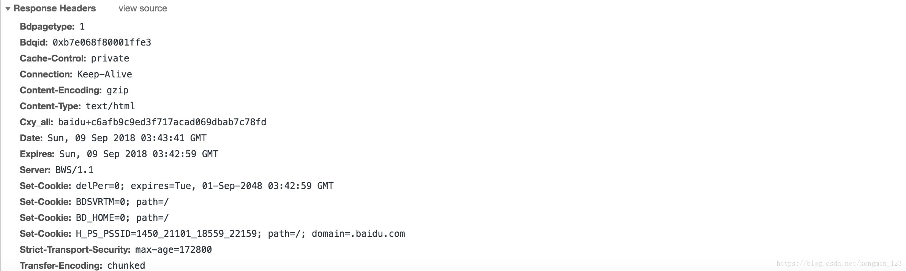

# 网络编程(四)：输入一个URL后发生了什么？

> 当在浏览器上输入了一个网址，例如https://www.baidu.com/，按回车后发生了什么？

## 一 DNS 解析

DNS解析的过程就是寻找哪台机器上有你需要资源的过程，寻找的过程遵循就近原则。

输入一个网址并按回车的时候浏览器会根据输入的URL去查找对应的IP，具体过程如下：

（1）首先是查找**浏览器缓存**，浏览器会保存一段时间内访问过的一些网址的DNS信息，不同浏览器保存的时常不等。

（2）如果没有找到对应的记录，这个时候浏览器会尝试调用**操作系统缓存**来继续查找这个网址的对应DNS信息。

（3）如果还是没找到对应的IP，那么接着会发送一个请求到**路由器**上，然后路由器在自己的路由器缓存上查找记录，路由器一般也存有DNS信息。

（4）如果还是没有，这个请求就会被发送到ISP（注：Internet Service Provider，互联网服务提供商，就是网络运营商，中国电信中国移动等），ISP也会有相应的ISP DNS服务器，就是本地**DNS服务器**，请求的域名基本上都能在这里找得到。

（5）如果还是没有的话， ISP的DNS服务器会将请求发向**根域名服务器**进行搜索。根域名服务器就是面向全球的顶级DNS服务器，共有13台逻辑上的服务器，从A到M命名，真正的实体服务器则有几百台，分布于全球各大洲。

（6）如果到了这里还是找不到域名的对应信息，那只能说明一个问题：这个域名本来就不存在，它没有在网上正式注册过。或者域名过期了。

这也就是为什么有时候打开一个新页面会有点慢，因为如果本地没什么缓存，查找域名的过程要这样递归地查询下去，查找完还要一层层的向上返回。例如"mp3.baidu.com"，域名先是解析出这是个.com的域名，然后跑到管理.com域的服务器上进行进一步查询，然后是.baidu，最后是mp3， 所以域名结构为：三级域名.二级域名.一级域名。

**所以DNS根据域名查询IP地址的过程为：浏览器缓存 --> 操作系统缓存 --> 路由器缓存-->本地（ISP）域名服务器缓存 --> 根域名服务器。**

## 二 进行 TCP 连接

浏览器终于得到了IP以后，向服务器发送TCP连接，TCP连接经过三次握手。

## 三 浏览器发送 HTTP 请求

浏览器和服务器建立连接以后，浏览器接着给这个IP地址给服务器发送一个http请求，方式为get，例如访问www.baidu.com。其本质是在建立起的TCP连接中，按照HTTP协议标准发送一个索要网页的请求。

这个get请求包含了主机（Host）、用户代理(User-Agent)，用户代理就是自己的浏览器，它是你的"代理人"，Connection（连接属性）中的keep-alive表示浏览器告诉对方服务器在传输完现在请求的内容后不要断开连接，不断开的话下次继续连接速度就很快了。可能还会有Cookies，Cookies保存了用户的登陆信息，一般保存的是用户的JSESSIONID，在每次向服务器发送请求的时候会重复发送给服务器。

在建立连接发送请求时每个服务端需要和客户端保持通信，有很多客户端都会和服务器进行通信。服务器为了识别是哪个客户端与它通信，就必须用一个标识记录客户端的信息。客户端首次访问服务器，服务端返回响应时通过附带一个记录的客户端信息的标识来返回给客户端，这个标识就是JSESSIONID，JSESSIONID就放在了客户端的Cookies里。当客户端再次向服务器发送请求时上就使用上次记录的Cookies里面的JSESSIONID，这样服务器就知道是哪个浏览器了。这样他们之间就能保持通信了。

发送完请求接下来就是等待回应了，如下图：

## 四 服务器处理请求

发送完请求接下来就是等待回应了，如下图：

服务器收到浏览器的请求以后），会解析这个请求（读请求头），然后生成一个响应头和具体响应内容。接着服务器会传回来一个响应头和一个响应，响应头告诉了浏览器一些必要的信息，例如重要的Status Code，2开头如200表示一切正常，3开头表示重定向，4开头是客户端错误，如404表示请求的资源不存在，5开头表示服务器端错误。响应就是具体的要请求的页面内容。

## 五 浏览器解析渲染页面

**（1）浏览器显示HTML**

当服务器返回响应之后，浏览器读取关于这个响应的说明书（响应头），然后开始解析这个响应并在页面上显示出来。

浏览器打开一个网址的时候会慢慢加载这个页面，一部分一部分的显示，直到完全显示，知道最后的旋转进度条停止。因此在浏览器没有完整接受全部HTML文档时，它就已经开始显示这个页面了。

**（2）浏览器向服务器发送请求获取嵌入在HTML中的对象**

在浏览器显示HTML时，打开一个网页的过程中，主页（index）页面框架传送过来以后，浏览器还会因页面上的静态资源多次发起连接请求，需要获取嵌入在HTML中的其他地址的资源。这时，浏览器会发送一些请求来获取这些文件。这些内容也要一点点地请求过来，所以标签栏转啊转，内容刷啊刷，最后全部请求并加载好了就终于好了。

这时请求的内容是主页里面包含的一些资源，如图片，视频，css样式，JavaScript文件等等。

这在文件属于静态文件，首次访问会留在浏览器的缓存中，过期才会从服务器去取。缓存的内容通常不会保存很久，因为难保网站不会被改动。

静态的文件一般会从CDN中去取，CDN根据请求获取资源的时候可能还会用到负载均衡。

**（3）浏览器发送异步（AJAX）请求**

对于那些动态的请求，动态网页等就必须要从服务器获取了。对于静态的页面内容，浏览器通常会进行缓存，而对于动态的内容，浏览器通常不会进行缓存。对于这些动态请求，Nginx可能会专门设置一些服务器用来处理这些访问动态页面的请求。

## 六 关闭TCP连接

当数据完成请求到返回的过程之后，根据Connection的Keep-Alive属性可以选择是否断开TCP连接，HTTP/1.1一般支持同一个TCP多个请求，而不是1.0版本下的完成一次请求就发生断开。TCP的断开与连接不一样，断开可以分为主动关闭和被动关闭，需要经过4次握手。

当浏览器需要的全部数据都已经加载完毕，一个页面就显示完了。

## 参考内容

【1】[输入一个网址后发生了什么](https://blog.csdn.net/kongmin_123/article/details/82555936)