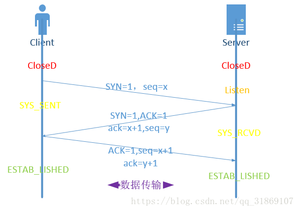
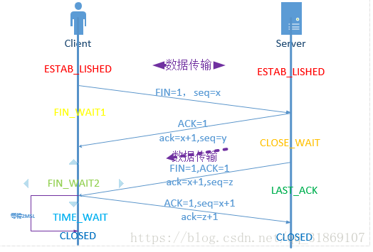

# 网络编程(一)：TCP的三次握手与四次挥手

需要了解TCP的握手与挥手，就需要知道以下标志量：

- SYN：请求同步标志，为1的时候为有效 

- ACK：应答标志，表示接受到所发的数据，1为有效 
- FIN：结束请求标志，1为有效
- ack：应答，值为告诉对方下一次所发数据地址 
- seq：值为所发数据地址

## TCP握手

根据图片所示： 

1. 客户机主动唤醒处在Listen状态下的服务器，发送：SYN=1,seq=x表示请求同步，所发数据地址为x 
2. 当服务器接收到数据后，返回：SYN=1，ACK=1，seq=y,ack=x+1（合并的步骤），表示同步请求恢复，收到客户机所发数据，服务器发送数据地址为y，提醒客户机该发送地址为x+1的数据 
3. 接收到服务器反馈后客户机进行应答：ACK=1，seq=x+1，ack=y+1,表示接受到所发消息，本次数据地址为x+1，提醒服务器下次应发y+1地址的数据

**TCP连接中seq和ack是什么东西呢？**

seq是序列号，这是为了连接以后传送数据用的，ack是对收到的数据包的确认，值是等待接收的数据包的序列号。

1. 在第一次消息发送中，A随机选取一个序列号作为自己的初始序号发送给B；

2. 第二次消息B使用ack对A的数据包进行确认，因为已经收到了序列号为x的数据包，准备接收序列号为x+1的包，所以ack=x+1，同时B告诉A自己的初始序列号，就是seq=y；

3. 第三条消息A告诉B收到了B的确认消息并准备建立连接，A自己此条消息的序列号是x+1，所以seq=x+1，而ack=y+1是表示A正准备接收B序列号为y+1的数据包。

seq是数据包本身的序列号；ack是期望对方继续发送的那个数据包的序列号。

**为什么需要三次握手呢**？

为了防止已失效的连接请求报文段突然又传送到了服务端，因而产生错误。

比如：client发出的第一个连接请求报文段并没有丢失，而是在某个网络结点长时间的滞留了，以致延误到连接释放以后的某个时间才到达server。本来这是一个早已失效的报文段，但是server收到此失效的连接请求报文段后，就误认为是client再次发出的一个新的连接请求，于是就向client发出确认报文段，同意建立连接。

假设不采用“三次握手”，那么只要server发出确认，新的连接就建立了，由于client并没有发出建立连接的请求，因此不会理睬server的确认，也不会向server发送数据，但server却以为新的运输连接已经建立，并一直等待client发来数据。所以没有采用“三次握手”，这种情况下server的很多资源就白白浪费掉了。

## TCP挥手

1. 首先客户机是主动发起断开连接请求的（结合实际也能理解），向服务器发送：FIN=1，seq=x，表示客户机向服务器发送断开连接的申请标志位，客户机所发送数据地址为x 

2. 服务器接收到数据后，ACK=1,seq=y,ack=x+1,这个就不解释了吧，但需要对比握手操作的是为什么后面服务器还发送了一次，而不是将两步合为一步，因为在服务器接收到客户机的断开请求后，可能还有些数据正在传输或未传输且需要传输，因此服务器先回复客户机表示接收到你的断开请求但还不能够断开，
3. 当数据传输完成后再次回复FIN=1,ACK=1,seq=z,ack=x+1表示可以断开了，注意这时seq变为z（就是不同于上面）因为中间数据传输了，地址变化了。 
4. 最后客户机回复：ACK=1,seq=x+1,ack=z+1

**【注意】** 在TIME_WAIT状态中，如果TCP client端最后一次发送的ACK丢失了，它将重新发送。TIME_WAIT状态中所需要的时间是依赖于实现方法的。典型的值为30秒、1分钟和2分钟。等待之后连接正式关闭，并且所有的资源(包括端口号)都被释放。

**【问题1】为什么连接的时候是三次握手，关闭的时候却是四次握手？**

答：因为当Server端收到Client端的SYN连接请求报文后，可以直接发送SYN+ACK报文。其中ACK报文是用来应答的，SYN报文是用来同步的。但是关闭连接时，当Server端收到FIN报文时，很可能并不会立即关闭SOCKET，所以只能先回复一个ACK报文，告诉Client端，"你发的FIN报文我收到了"。只有等到我Server端所有的报文都发送完了，我才能发送FIN报文，因此不能一起发送。故需要四步握手。

**【问题2】MSL是什么？**

首先我们要知道**MSL(Maximum Segment Lifetime)**代表的是**报文最大生存时间**，指报文在网络中所能存在的最大时长，超过这个时间报文将被丢弃。因为 TCP 报文基于是 IP 协议的，而 IP 头中有一个 `TTL` 字段，是 IP 数据报可以经过的最大路由数，每经过一个处理他的路由器此值就减 1，当此值为 0 则数据报将被丢弃，同时发送 ICMP 报文通知源主机。

TIME_WAIT 等待 2 倍的 MSL，比较合理的解释是：网络中可能存在来自发送方的数据包，当这些发送方的数据包被接收方处理后又会向对方发送响应，所以**一来一回需要等待 2 倍的时间**。

比如如果被动关闭方没有收到断开连接的最后的 ACK 报文，就会触发超时重发 Fin 报文，另一方接收到 FIN 后，会重发 ACK 给被动关闭方， 一来一去正好 2 个 MSL。

`2MSL` 的时间是从**客户端接收到 FIN 后发送 ACK 开始计时的**。如果在 TIME-WAIT 时间内，因为客户端的 ACK 没有传输到服务端，客户端又接收到了服务端重发的 FIN 报文，那么 **2MSL 时间将重新计时**。

在 Linux 系统里 `2MSL` 默认是 `60` 秒，那么一个 `MSL` 也就是 `30` 秒。**Linux 系统停留在 TIME_WAIT 的时间为固定的 60 秒**。

其定义在 Linux 内核代码里的名称为 TCP_TIMEWAIT_LEN：

**define TCP_TIMEWAIT_LEN (60*HZ) /* how long to wait to destroy TIME-WAIT state, about 60 seconds** 

如果要修改 TIME_WAIT 的时间长度，只能修改 Linux 内核代码里 TCP_TIMEWAIT_LEN 的值，并重新编译 Linux 内核。

**【问题3】为什么TIME_WAIT状态需要经过2MSL(最大报文段生存时间)才能返回到CLOSE状态？**

1. **保证「被动关闭连接」的一方能被正确的关闭，即保证最后的 ACK 能让被动关闭方接收，从而帮助其正常关闭；**为了保证A发送的最后一个ACK报文段能够到达B。即最后这个确认报文段很有可能丢失，那么B会超时重传，然后A再一次确认，同时启动2MSL计时器，如此下去。如果没有等待时间，发送完确认报文段就立即释放连接的话，B就无法重传了（连接已被释放，任何数据都不能出传了），因而也就收不到确认，就无法按照步骤进入CLOSE状态，即必须收到确认才能close。
2. **防止具有相同「四元组」的「旧」数据包被收到；**防止“已失效的连接请求报文段”出现在连接中。经过2MSL，那些在这个连接持续的时间内，产生的所有报文段就可以从网络中消失。即在这个连接释放的过程中会有一些无效的报文段滞留在楼阁结点，但是呢，经过2MSL这些无效报文段就肯定可以发送到目的地，不会滞留在网络中。这样的话，在下一个连接中就不会出现上一个连接遗留下来的请求报文段了。

可以看出：B结束TCP连接的时间比A早一点，因为B收到确认就断开连接了，而A还得等待2MSL。

## 参考内容

【1】[TCP握手与挥手详解（附有图）](https://blog.csdn.net/qq_31869107/article/details/81327494)

【2】[TCP连接中seq和ack是什么东西呢](https://blog.csdn.net/m0_47354578/article/details/109717014)

【3】[TCP 握手和挥手图解（有限状态机）](https://blog.csdn.net/xy010902100449/article/details/48274635)

