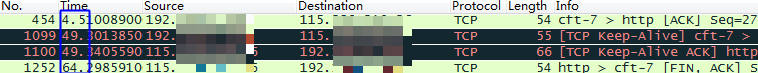

# 网络编程(六)：长连接与短连接

**本文总结&分享网络编程中涉及的长连接、短连接概念。**

  **关键字：Keep-Alive，并发连接数限制，TCP，HTTP**

## 一、什么是长连接

HTTP1.1规定了**默认保持长连接**（HTTP persistent connection ，也有翻译为持久连接），数据传输完成了保持TCP连接不断开（不发RST包、不四次握手），等待在同域名下继续用这个通道传输数据；相反的就是短连接。

HTTP首部的Connection: Keep-alive是HTTP1.0浏览器和服务器的实验性扩展，当前的HTTP1.1 RFC2616文档没有对它做说明，因为它所需要的功能已经默认开启，无须带着它，但是实践中可以发现，浏览器的报文请求都会带上它。如果HTTP1.1版本的HTTP请求报文不希望使用长连接，则要在HTTP请求报文首部加上Connection: close。

《HTTP权威指南》提到，有部分古老的HTTP1.0 代理不理解Keep-alive，而导致长连接失效：客户端-->代理-->服务端，客户端带有Keep-alive，而代理不认识，于是将报文原封不动转给了服务端，服务端响应了Keep-alive，也被代理转发给了客户端，于是保持了“客户端-->代理”连接和“代理-->服务端”连接不关闭，但是，当客户端第发送第二次请求时，代理会认为当前连接不会有请求了，于是忽略了它，长连接失效。

书上也介绍了解决方案：当发现HTTP版本为1.0时，就忽略Keep-alive，客户端就知道当前不该使用长连接。其实，在实际使用中不需要考虑这么多，很多时候代理是我们自己控制的，如Nginx代理，代理服务器有长连接处理逻辑，服务端无需做patch处理，常见的是客户端跟Nginx代理服务器使用HTTP1.1协议&长连接，而Nginx代理服务器跟后端服务器使用HTTP1.0协议&短连接。

**在实际使用中，HTTP头部有了Keep-Alive这个值并不代表一定会使用长连接**，客户端和服务器端都可以无视这个值，也就是不按标准来，譬如我自己写的HTTP客户端多线程去下载文件，就可以不遵循这个标准，并发的或者连续的多次GET请求，都分开在多个TCP通道中，每一条TCP通道，只有一次GET，GET完之后，立即有TCP关闭的四次握手，这样写代码更简单，这时候虽然HTTP头有Connection: Keep-alive，但不能说是长连接。正常情况下客户端浏览器、web服务端都有实现这个标准，因为它们的文件又小又多，保持长连接减少重新开TCP连接的开销很有价值。

   以前使用[libcurl做的上传](http://www.cnblogs.com/cswuyg/p/3185164.html)/下载，就是短连接，抓包可以看到：1、每一条TCP通道只有一个POST；2、在数据传输完毕可以看到四次握手包。只要不调用curl_easy_cleanup，curl的handle就可能一直有效，可复用。这里说可能，因为连接是双方的，如果服务器那边关掉了，那么我客户端这边保留着也不能实现长连接。   

  如果是使用windows的WinHTTP库，则在POST/GET数据的时候，虽然我关闭了句柄，但这时候TCP连接并不会立即关闭，而是等一小会儿，这时候是WinHTTP库底层支持了跟Keep-alive所需要的功能：即便没有Keep-alive，WinHTTP库也可能会加上这种TCP通道复用的功能，而其它的网络库像libcurl则不会这么做。以前观察过[WinHTTP库不会及时断开TCP连接](http://www.cnblogs.com/cswuyg/p/3516417.html)。

## 二、长连接的过期时间

  客户端的长连接不可能无限期的拿着，会有一个超时时间，服务器有时候会告诉客户端超时时间，譬如：

 上图中的Keep-Alive: timeout=20，表示这个TCP通道可以保持20秒。另外还可能有max=XXX，表示这个长连接最多接收XXX次请求就断开。对于客户端来说，如果服务器没有告诉客户端超时时间也没关系，服务端可能主动发起四次握手断开TCP连接，客户端能够知道该TCP连接已经无效；另外TCP还有心跳包来检测当前连接是否还活着，方法很多，避免浪费资源。

## 三、长连接的数据传输完成识别

  使用长连接之后，客户端、服务端怎么知道本次传输结束呢？两部分：1是判断传输数据是否达到了Content-Length指示的大小；2动态生成的文件没有Content-Length，它是分块传输（chunked），这时候就要根据chunked编码来判断，chunked编码的数据在最后有一个空chunked块，表明本次传输数据结束。更细节的介绍可以看[这篇文章](http://www.cnblogs.com/skynet/archive/2010/12/11/1903347.html)。

## 四、并发连接数的数量限制

  在web开发中需要关注浏览器并发连接的数量，[RFC文档](http://tools.ietf.org/html/rfc2616#page-47)说，客户端与服务器最多就连上两通道，但服务器、个人客户端要不要这么做就随人意了，有些服务器就限制同时只能有1个TCP连接，导致客户端的多线程下载（客户端跟服务器连上多条TCP通道同时拉取数据）发挥不了威力，有些服务器则没有限制。浏览器客户端就比较规矩，[知乎这里有分析](http://www.zhihu.com/question/20474326)，限制了同域名下能启动若干个并发的TCP连接去下载资源。并发数量的限制也跟长连接有关联，打开一个网页，很多个资源的下载可能就只被放到了少数的几条TCP连接里，这就是TCP通道复用（长连接）。如果并发连接数少，意味着网页上所有资源下载完需要更长的时间（用户感觉页面打开卡了）；并发数多了，服务器可能会产生更高的资源消耗峰值。浏览器只对同域名下的并发连接做了限制，也就意味着，web开发者可以把资源放到不同域名下，同时也把这些资源放到不同的机器上，这样就完美解决了。

## 五、容易混淆的概念——TCP的keep alive和HTTP的Keep-alive

  TCP的keep alive是检查当前TCP连接是否活着；HTTP的Keep-alive是要让一个TCP连接活久点。它们是不同层次的概念。

  TCP keep alive的表现：

  当一个连接“一段时间”没有数据通讯时，一方会发出一个心跳包（Keep Alive包），如果对方有回包则表明当前连接有效，继续监控。

这个“一段时间”可以设置。

WinHttp库的设置：

> WINHTTP_OPTION_WEB_SOCKET_KEEPALIVE_INTERVAL
> Sets the interval, in milliseconds, to send a keep-alive packet over the connection. The default interval is 30000 (30 seconds). The minimum interval is 15000 (15 seconds). Using WinHttpSetOption to set a value lower than 15000 will return with ERROR_INVALID_PARAMETER.

libcurl的设置：

http://curl.haxx.se/libcurl/c/curl_easy_setopt.html

> CURLOPT_TCP_KEEPALIVE
>
> Pass a long. If set to 1, TCP keepalive probes will be sent. The delay and frequency of these probes can be controlled by the CURLOPT_TCP_KEEPIDLE and CURLOPT_TCP_KEEPINTVL options, provided the operating system supports them. Set to 0 (default behavior) to disable keepalive probes (Added in 7.25.0).
>
> CURLOPT_TCP_KEEPIDLE
>
> Pass a long. Sets the delay, in seconds, that the operating system will wait while the connection is idle before sending keepalive probes. Not all operating systems support this option. (Added in 7.25.0)
>
> CURLOPT_TCP_KEEPINTVL
>
> Pass a long. Sets the interval, in seconds, that the operating system will wait between sending keepalive probes. Not all operating systems support this option. (Added in 7.25.0)

   CURLOPT_TCP_KEEPIDLE是空闲多久发送一个心跳包，CURLOPT_TCP_KEEPINTVL是心跳包间隔多久发一个。 

打开网页抓包，发送心跳包和关闭连接如下：

 从上图可以看到，大概过了44秒，客户端发出了心跳包，服务器及时回应，本TCP连接继续保持。到了空闲60秒的时候，服务器主动发起FIN包，断开连接。

## 六、HTTP 流水线技术

  使用了HTTP长连接（HTTP persistent connection ）之后的好处，包括可以使用HTTP 流水线技术（HTTP pipelining，也有翻译为管道化连接），它是指，**在一个TCP连接内，多个HTTP请求可以并行，下一个HTTP请求在上一个HTTP请求的应答完成之前就发起。**从wiki上了解到这个技术目前并没有广泛使用，使用这个技术必须要求客户端和服务器端都能支持，目前有部分浏览器完全支持，而服务端的支持仅需要：按HTTP请求顺序正确返回Response（也就是请求&响应采用FIFO模式），wiki里也特地指出，只要服务器能够正确处理使用HTTP pipelinning的客户端请求，那么服务器就算是支持了HTTP pipelining。

  由于要求服务端返回响应数据的顺序必须跟客户端请求时的顺序一致，这样也就是要求FIFO，这容易导致Head-of-line blocking：第一个请求的响应发送影响到了后边的请求，因为这个原因导致HTTP流水线技术对性能的提升并不明显（wiki提到，这个问题会在HTTP2.0中解决）。另外，使用这个技术的还必须是幂等的HTTP方法，因为客户端无法得知当前已经处理到什么地步，重试后可能发生不可预测的结果。POST方法不是幂等的：同样的报文，第一次POST跟第二次POST在服务端的表现可能会不一样。

  在HTTP长连接的wiki中提到了HTTP1.1的流水线技术对RFC规定一个用户最多两个连接的指导意义：流水线技术实现好了，那么多连接并不能提升性能。我也觉得如此，并发已经在单个连接中实现了，多连接就没啥必要，除非瓶颈在于单个连接上的资源限制迫使不得不多开连接抢资源。

  目前浏览器并不太重视这个技术，毕竟性能提升有限。

## 参考内容

【1】[HTTP的长连接和短连接](https://www.cnblogs.com/cswuyg/p/3653263.html)